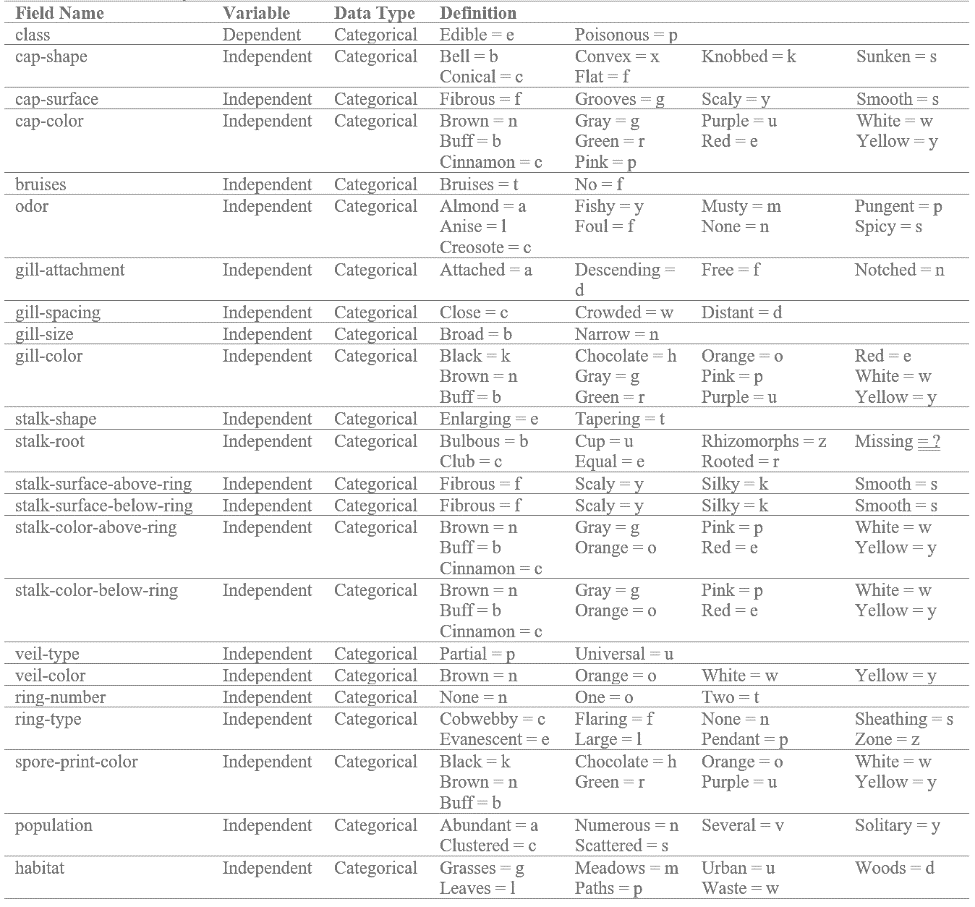

---
title:
  <fontsize = 100>
  "Classification of Edible & Poisonous Mushrooms"
  </font>
 
author:
  "Brooke Seibert"
output: 
  flexdashboard::flex_dashboard:
    theme: readable
    vertical_layout: fill
---

```{r setup, include=FALSE}
#yeti
library(tidyverse)
library(broom)
library(glmnet)
library(caret)
library(ISLR)
library(janitor)
library(stringr)
library(rsample)
library(ggplot2)
library(GGally)
library(gridExtra)
library(dplyr)
library(MASS)
library(plotROC)
library(randomForest)
library(rpart)
library(rpart.plot)
library(partykit)
library(nnet)
library(tree)
library(reshape)
library(flexdashboard)
theme_set(theme_bw())
df <- readr::read_csv("mushrooms.csv")
```

```{r, data cleaning}
#develop friendly variable names
colnames(df)[colnames(df)=="class"] <- "Class"
colnames(df)[colnames(df)=="cap-shape"] <- "CapShape"
colnames(df)[colnames(df)=="cap-surface"] <- "CapSurface"
colnames(df)[colnames(df)=="cap-color"] <- "CapColor"
colnames(df)[colnames(df)=="bruises"] <- "Bruises"
colnames(df)[colnames(df)=="odor"] <- "Odor"
colnames(df)[colnames(df)=="gill-attachment"] <- "GillAttachment"
colnames(df)[colnames(df)=="gill-spacing"] <- "GillSpacing"
colnames(df)[colnames(df)=="gill-size"] <- "GillSize"
colnames(df)[colnames(df)=="gill-color"] <- "GillColor"
colnames(df)[colnames(df)=="stalk-shape"] <- "StalkShape"
colnames(df)[colnames(df)=="stalk-root"] <- "StalkRoot"
colnames(df)[colnames(df)=="stalk-surface-above-ring"] <- "StalkSurfaceAboveRing"
colnames(df)[colnames(df)=="stalk-surface-below-ring"] <- "StalkSurfaceBelowRing"
colnames(df)[colnames(df)=="stalk-color-above-ring"] <- "StalkColorAboveRing"
colnames(df)[colnames(df)=="stalk-color-below-ring"] <- "StalkColorBelowRing"
colnames(df)[colnames(df)=="veil-type"] <- "VeilType"
colnames(df)[colnames(df)=="veil-color"] <- "VeilColor"
colnames(df)[colnames(df)=="ring-number"] <- "RingNumber"
colnames(df)[colnames(df)=="ring-type"] <- "RingType"
colnames(df)[colnames(df)=="spore-print-color"] <- "SporePrintColor"
colnames(df)[colnames(df)=="population"] <- "Population"
colnames(df)[colnames(df)=="habitat"] <- "Habitat"
# Change all variables from characters into factors
df[sapply(df, is.character)] <- lapply(df[sapply(df, is.character)], as.factor)
old_df <- df
# Remove VeilType (only 1 level: p = partical)
#nlevels(df$VeilType)
df <- df[-c(17)]
# Remove VeilColor (vastly 1 level split fairly evenly: w = white)
df <- df[-c(17)]
# Remove GillAttachment (vastly 1 level split fairly evently: f = free)
df <- df[-c(7)]
# Remove any rows with NULLs
df <- na.omit(df)
```

```{r, data partiton}
set.seed(298329)
inTraining <- createDataPartition(df$Class, p = .5, list = F)
training <- df[inTraining, ]
testing  <- df[-inTraining, ]
```

Data Understanding {data-orientation=columns}
===============================================================

------------------------------------

-------------------------------------


Column {data-width=300}
-------------------------------------

### <big>**Project Overview**</big>
There is no simple rule for determining the edibility of a mushroom.  Despite the risk, mushroom hunting is growing in popularity.  Therefore, data was collected from the Audubon Society Field Guide to North American Mushrooms in attempt to facilitate identifying foraged mushrooms as being edible or poisonous.  Availabe records cover 23 different gilled mushroom species from the Agaricus and the Lepiota Mushroom Family.  Each mushroom record is classified as either being edible or poisonous.  This data will be used to explore different analytical modeling techniques to ultimately determine if there is a model can properly classify poisonous and edible mushrooms.  Exploratory data analysis will also study if particular mushroom characteristics are more highly indicative of a mushroom being poisonous or a mushroom being edible.

 <style>
.reveal .slides section .slideContent ul li{
    font-size: 30pt;
}
</style>
 
### <big>**Business Questions**</big>

•	Which analytical model can best classify poisonous and edible mushrooms?

•	Are certain mushroom characteristics only indicative of a mushroom being poisonous?

•	Are certain mushroom characteristics only indicative of a mushroom being edible? 

<style>
.reveal .slides section .slideContent ul li{
    font-size: 40pt;
}
</style>

### <big>**Data Source**</big>
The dataset was found through Kaggle, formatted as a CSV file with 8,124 records and 23 fields.  The dataset originated from the UCI Machine Learning repository's mushroom dataset developed in 1987.  (https://www.kaggle.com/uciml/mushroom-classification/version/1#_=_).  The mushroom records correspond to 23 gilled mushrooms species in the Agaricus and Lepiota Mushroom Family from the Audubon Society Field Guide to North American Mushrooms.

<style>
.reveal .slides section .slideContent ul li{
    font-size: 40pt;
}
</style>

Column {data-width=700}
-------------------------------------

### <big>**Variable Dictionary**</big>


Exploratory Analysis {data-orientation=columns}
===============================================================

------------------------------------

-------------------------------------

Column {data-width=150}
-------------------------------------

### <big>**Proportion of Edible Mushrooms**</big>

```{r, e proportion}
ep <- "51.80%"
valueBox(ep, color = "lightseagreen")
```

### <big>**Proportion of Poisonous Mushrooms**</big>

```{r, p proportion}
pp <- "48.20%"
valueBox(pp, color = "indianred")
```

### <big>**Total Observations**</big>

```{r, observation count}
pp <- "8124"
valueBox(pp, color = "lightgray")
```

### <big>**Total Variables**</big>

```{r, variable count}
total_variables <- length(old_df)
valueBox(total_variables, color = "lightgray")
```

Column {data-width=450}
-------------------------------------

### <big>**Variable Cross Tabulation Matrix**</big>


CV Classification Tree {data-orientation=rows}
==================================================================================

------------------------------------

-------------------------------------


Row {data-height=500}
---------------------------------------------------------------------------------

### <big>**Cross-Validation Classification Tree Model**</big>

```{r, cv tree}
cv_tree <- rpart::rpart(Class ~ ., data = training)
plot(as.party(cv_tree))
predict_tree <- predict(cv_tree, testing, positive = "e", type = "class")
#summary(cv_tree)
#variable importance: Odor-28, GillColor-16, StalkSurfaceAboveRing-15, StalkSurfaceBelowRing-15, GillSize-13, Bruises-13
#node 1: 4062, node 2: 2159, node 3: 1903
#Primary splits: Odor, GillColor, StalkSurfaceAboveRing, StalkSurfaceBelowRing, GillSize
#Surrogate splits: GillColor, StalkSurfaceAboveRing, StalkSurfaceBelowRing, GillSize, Bruises
```

Row {data-height=300}
------------------------------------------------------------------------------

### <big>**Confusion Matrix**</big>

```{r, cv confusion matrix}
#confusionMatrix(as.factor(predict_tree),as.factor(testing$Class))
# confusion matrix visual
TClass <- factor(c(0, 0, 1, 1))
PClass <- factor(c(0, 1, 0, 1))
Y      <- c(0, 2104, 1937, 21)
c <- data.frame(TClass, PClass, Y)
ggplot(data =  c, mapping = aes(x = TClass, y = PClass)) +
  geom_tile(aes(fill = Y), colour = "white") +
  geom_text(aes(label = sprintf("%1.0f", Y)), vjust = 1) +
  scale_fill_gradient(low = "lightseagreen", high = "indianred") +
  theme_bw() + theme(legend.position = "none")+ ggtitle("Cross Validation Tree Confusion Matrix") + xlab("True Class") + ylab("Predicted Class")
```

### <big>**Accuracy Rate**</big>

```{r, cv gauge}
gauge(99.48, min = 0, max = 100, symbol = '%', gaugeSectors(
  success = c(80, 100), warning = c(40, 79), danger = c(0,39), color = "lightseagreen"
))
```

### <big>**Cross Validation Size Plot**</big>

```{r, cv plot 1}
#plots
set.seed(3)
a_tree <- tree(Class ~ ., data = training)
cv_tree <- cv.tree(a_tree ,FUN=prune.misclass )
#names(cv_tree )
plot(cv_tree$size, cv_tree$dev, type="b")
```

### <big>**Cross Validation Tree Plot**</big>

```{r, cv plot 2}
plot(cv_tree$k, cv_tree$dev, type="b")
```

Pruned Classification Tree {data-orientation=rows}
===============================================================================

------------------------------------

-------------------------------------


Row {data-height=500}
--------------------------------------------------------------------------------

### <big>**Pruned Classification Tree Model**</big>

```{r, prune tree}
prune_tree <- prune.misclass(a_tree,best=5)
plot(prune_tree)
text(prune_tree, pretty =0)
predict_prune <- predict(prune_tree, testing, positive = "e",type="class")
#summary(prune_tree)
```

Row {data-height=300}
--------------------------------------------------------------------------------

### <big>**Confusion Matrix**</big>

```{r, prune confusion matrix}
#confusionMatrix(as.factor(predict_prune),as.factor(testing$Class))
# confusion matrix visual
TClass <- factor(c(0, 0, 1, 1))
PClass <- factor(c(0, 1, 0, 1))
Y      <- c(0, 2104, 1953, 5)
b <- data.frame(TClass, PClass, Y)
ggplot(data =  b, mapping = aes(x = TClass, y = PClass)) +
  geom_tile(aes(fill = Y), colour = "white") +
  geom_text(aes(label = sprintf("%1.0f", Y)), vjust = 1) +
  scale_fill_gradient(low = "lightseagreen", high = "indianred") +
  theme_bw() + theme(legend.position = "none")+ ggtitle("Pruned Classification Tree Confusion Matrix") + xlab("True Class") + ylab("Predicted Class")
```

### <big>**Accuracy Rate**</big>

```{r, prune gauge}
gauge(99.88, min = 0, max = 100, symbol = '%', gaugeSectors(
  success = c(80, 100), warning = c(40, 79), danger = c(0,39), color = "lightseagreen"
))
```

Multinominal Logistic Regression {data-orientation=columns}
==================================================================================

------------------------------------

-------------------------------------

Column {.tabset}
--------------------------------------

### <big>**Original Multinominal Logistic Regression**</big>

```{r, multinominal logistic regression}
# Basic Multinominal Logistic Regression with Training Data
train_mlr <- multinom(Class ~ ., data = training)
summary(train_mlr)
s_mlr_train <- summary(train_mlr)$coefficients/summary(train_mlr)$standard.errors
s_mlr_train
# 2-tailed z test
z_mlr_train <- (1 - pnorm(abs(s_mlr_train), 0, 1)) * 2
z_mlr_train
# extract the coefficients from the model and exponentiate
oec <- exp(coef(train_mlr))
oec
# predicted probabilities
pp <- fitted(train_mlr)
# predict on testing data
predicted_scores <- predict (train_mlr, testing, "probs")
```

###<big>**Confusion Matrix**</big> 

```{r, multinomial logistic regression confusion matrix}
predict_mlr <- predict(train_mlr, testing, positive = "e")
#confusionMatrix(as.factor(predict_mlr),as.factor(testing$Class))
# confusion matrix visual
TClass <- factor(c(0, 0, 1, 1))
PClass <- factor(c(0, 1, 0, 1))
Y      <- c(0, 2104, 1955, 3)
d <- data.frame(TClass, PClass, Y)
ggplot(data =  d, mapping = aes(x = TClass, y = PClass)) +
  geom_tile(aes(fill = Y), colour = "white") +
  geom_text(aes(label = sprintf("%1.0f", Y)), vjust = 1) +
  scale_fill_gradient(low = "lightseagreen", high = "indianred") +
  theme_bw() + theme(legend.position = "none")+ ggtitle("Original Multinominal Logistic Regression Confusion Matrix") + xlab("True Class") + ylab("Predicted Class")
```

###<big>**Accuracy Rate**</big>  

```{r, regression gauge}
gauge(99.93, min = 0, max = 100, symbol = '%', gaugeSectors(
  success = c(80, 100), warning = c(40, 79), danger = c(0,39), color = "lightseagreen"
))
```

Column {.tabset}
---------------------------------------------------------------------------------

###<big>**Revised Multinominal Logistic Regression**</big>

```{r, multinominal logistic regression 2}
# Basic Multinominal Logistic Regression with Training Data
train_mlr_2 <- multinom(Class ~ Odor+GillColor+StalkSurfaceAboveRing+StalkSurfaceBelowRing+GillSize+Bruises+SporePrintColor+StalkColorBelowRing+StalkRoot, data = training)
summary(train_mlr_2)
s_mlr_train_2 <- summary(train_mlr_2)$coefficients/summary(train_mlr_2)$standard.errors
s_mlr_train_2
# 2-tailed z test
z_mlr_train_2 <- (1 - pnorm(abs(s_mlr_train), 0, 1)) * 2
z_mlr_train_2
# extract the coefficients from the model and exponentiate
opc <- exp(coef(train_mlr_2))
opc
# predicted probabilities
pp_2 <- fitted(train_mlr_2)
# predict on testing data
predicted_scores_2 <- predict (train_mlr_2, testing, "probs")
```

###<big>**Confusion Matrix**</big>  

```{r, multinomial logistic regression confusion matrix important variables}
predict_mlr_2 <- predict(train_mlr_2, testing, positive = "e")
#confusionMatrix(as.factor(predict_mlr_2),as.factor(testing$Class))
# confusion matrix visual
TClass <- factor(c(0, 0, 1, 1))
PClass <- factor(c(0, 1, 0, 1))
Y      <- c(0, 2104, 1958, 0)
g <- data.frame(TClass, PClass, Y)
ggplot(data =  g, mapping = aes(x = TClass, y = PClass)) +
  geom_tile(aes(fill = Y), colour = "white") +
  geom_text(aes(label = sprintf("%1.0f", Y)), vjust = 1) +
  scale_fill_gradient(low = "lightseagreen", high = "indianred") +
  theme_bw() + theme(legend.position = "none")+ ggtitle("Revised Multinominal Logistic Regression Confusion Matrix") + xlab("True Class") + ylab("Predicted Class")
```

###<big>**Accuracy Rate**</big>  

```{r, regression gauge revised}
gauge(100, min = 0, max = 100, symbol = '%', gaugeSectors(
  success = c(80, 100), warning = c(40, 79), danger = c(0,39), color = "lightseagreen"
))
```

Analysis of Mushroom Characteristics {data-orientation=columns}
==================================================================================

------------------------------------

-------------------------------------

Column {data-width=230}
-------------------------------------

### <big>**Mushroom Characteristics Indicative of Edible Mushrooms**</big>

```{r, edible graphs}
# edible dataframe
e_df <- df[df$Class == "e",]
# poisonous dataframe
p_df <- df[df$Class == "p",]
#ODOR
e_odor <- ggplot(e_df, aes(Odor,..count.. )) + geom_bar(fill = "lightseagreen")+ theme(text = element_text(size=9)) + ggtitle("Edible Mushrooms by Odor")+ ylim(0, 4000)
e_odor
#GILL COLOR
e_gillcolor <- ggplot(e_df, aes(GillColor,..count.. )) + geom_bar(fill = "lightseagreen")+ theme(text = element_text(size=9)) + ggtitle("Edible Mushrooms by Gill Color")+ ylim(0, 4000)
e_gillcolor
#STALK SURFACE ABOVE RING
e_ssar <- ggplot(e_df, aes(StalkSurfaceAboveRing,..count.. )) + geom_bar(fill = "lightseagreen")+ theme(text = element_text(size=9)) + ggtitle("Edible Mushrooms by Stalk Surface Above Ring")+ ylim(0, 4000)
e_ssar
#STALK SURFACE BELOW RING
e_ssbr <- ggplot(e_df, aes(StalkSurfaceBelowRing,..count.. )) + geom_bar(fill = "lightseagreen")+ theme(text = element_text(size=9)) + ggtitle("Edible Mushrooms by Stalk Surface Below Ring")+ ylim(0, 4000)
e_ssbr
#GILL SIZE
e_gillsize <- ggplot(e_df, aes(GillSize,..count.. )) + geom_bar(fill = "lightseagreen")+ theme(text = element_text(size=9)) + ggtitle("Edible Mushrooms by Gill Size")+ ylim(0, 4000)
e_gillsize
#BRUISES
e_bruises <- ggplot(e_df, aes(Bruises,..count.. )) + geom_bar(fill = "lightseagreen")+ theme(text = element_text(size=9)) + ggtitle("Edible Mushrooms by Bruises")+ ylim(0, 4000)
e_bruises
#SPORE PRINT COLOR
e_spcolor <- ggplot(e_df, aes(SporePrintColor,..count.. )) + geom_bar(fill = "lightseagreen")+ theme(text = element_text(size=9)) + ggtitle("Edible Mushrooms by Spore Print Color")+ ylim(0, 4000)
e_spcolor
#STALK COLOR BELOW RING
e_scbr <- ggplot(e_df, aes(StalkColorBelowRing,..count.. )) + geom_bar(fill = "lightseagreen")+ theme(text = element_text(size=9)) + ggtitle("Edible Mushrooms by Stalk Color Below Ring")+ ylim(0, 4000)
e_scbr
#STALK ROOT
e_sroot <- ggplot(e_df, aes(StalkRoot,..count.. )) + geom_bar(fill = "lightseagreen")+ theme(text = element_text(size=9)) + ggtitle("Edible Mushrooms by Stalk Root")+ ylim(0, 4000)
e_sroot
```

Column {data-width=230}
--------------------------------------

### <big>**Mushroom Characteristics Indicative of Poisonous Mushrooms**</big>

```{r, poisonous graphs}
#ODOR
p_odor <- ggplot(p_df, aes(Odor,..count.. )) + geom_bar(fill = "indianred")+ theme(text = element_text(size=9)) + ggtitle("Poisonous Mushrooms by Odor")+ ylim(0, 4000)
p_odor
#GILL COLOR
p_gillcolor <- ggplot(p_df, aes(GillColor,..count.. )) + geom_bar(fill = "indianred")+ theme(text = element_text(size=9)) + ggtitle("Poisonous Mushrooms by Gill Color")+ ylim(0, 4000)
p_gillcolor
#STALK SURFACE ABOVE RING
p_ssar <- ggplot(p_df, aes(StalkSurfaceAboveRing,..count.. )) + geom_bar(fill = "indianred")+ theme(text = element_text(size=9)) + ggtitle("Poisonous Mushrooms by Stalk Surface Above Ring")+ ylim(0, 4000)
p_ssar
#STALK SURFACE BELOW RING
p_ssbr <- ggplot(p_df, aes(StalkSurfaceBelowRing,..count.. )) + geom_bar(fill = "indianred")+ theme(text = element_text(size=9)) + ggtitle("Poisonous Mushrooms by Stalk Surface Below Ring")+ ylim(0, 4000)
p_ssbr
#GILL SIZE
p_gillsize <- ggplot(p_df, aes(GillSize,..count.. )) + geom_bar(fill = "indianred")+ theme(text = element_text(size=9)) + ggtitle("Poisonous Mushrooms by Gill Size")+ ylim(0, 4000)
p_gillsize
#BRUISES
p_bruises <- ggplot(p_df, aes(Bruises,..count.. )) + geom_bar(fill = "indianred")+ theme(text = element_text(size=9)) + ggtitle("Poisonous Mushrooms by Bruises")+ ylim(0, 4000)
p_bruises
#SPORE PRINT COLOR
p_spcolor <- ggplot(p_df, aes(SporePrintColor,..count.. )) + geom_bar(fill = "indianred")+ theme(text = element_text(size=9)) + ggtitle("Poisonous Mushrooms by Spore Print Color")+ ylim(0, 4000)
p_spcolor
#STALK COLOR BELOW RING
p_scbr <- ggplot(p_df, aes(StalkColorBelowRing,..count.. )) + geom_bar(fill = "indianred")+ theme(text = element_text(size=9)) + ggtitle("Poisonous Mushrooms by Stalk Color Below Ring")+ ylim(0, 4000)
p_scbr
#STALK ROOT
p_sroot <- ggplot(p_df, aes(StalkRoot,..count.. )) + geom_bar(fill = "indianred")+ theme(text = element_text(size=9)) + ggtitle("Poisonous Mushrooms by Stalk Root")+ ylim(0, 4000)
p_sroot
```

Column {data-width=170}
--------------------------------------

### <big>**Overall Findings**</big>
**Odor**  
•	Only edible: almonds or anise  
•	Only poisonous: creosote, foul, musty, pungent, spicy, fishy  
•	Odorless mushrooms were more commonly edible  

**Gill Color**  
•	Only edible: red or orange  
•	Only poisonous: buff (most common) or green  
•	Edible counts all < 1000, poisonous counts all < 2000  

**Stalk Surface Above & Below Ring**  
•	Similar distirubuton for both variables  
•	No unique characteristics for being edible or poisonous  
•	Mostly edible: smooth above or below ring (~3,500 instances)  
•	But smooth stalk surface was commonly poisonous too  
•	Lowest representation in general were scaly stalk surfaces  

**Gill Size**  
•	Binary where broad or narrow gills could be edible or not
•	Edible: vastly more commonly broad (~4000) 
•	Poisonous: more commonly narrow 

**Bruises**  
•	Binary where bruising is not unique to a target
•	Edible mushrooms more commonly bruised   
•	Most poisonous mushrooms could not bruise (>3000)   

**Spore Print Color**   
•	Lower cateogry counts, below 2000 per level  
•	Only edible: buff or purple, though with low counts   
•	Only poisonous: green or yellow, also with low counts  
•	Most commonly edible: black or brown   
•	Most commonly poisonous: chocolate or white  

**Stalk Color Below Ring**  
•	White stalks were most common in general  
•	Only edible: gray (most common), red, orange  
•	Only poisonous: buff (most common), cinnamon, yellow   

**Stalk Root**  
•	All category counts were low, below 2000  
•	Only edible: rooted stalks  
•	Bulbous stalk roots were most common in general  
•	Missing stalk roots were more commonly poisonous   

**Chi Square Tests**  
Associations between pairs of important variables were tested with Chi Square. Based on results, all instances reveal there to be association between the pairs of variables. An example of some of the Chi Square Tests are shown below, in which the variables were tested again the target class.

<style>
.reveal .slides section .slideContent ul li{
    font-size: 40pt;
}
</style>
```{r, blablabal}
chisq.test(df$Class, df$Odor) 
chisq.test(df$Class, df$GillColor) 
chisq.test(df$Class, df$StalkSurfaceAboveRing) 
chisq.test(df$Class, df$StalkSurfaceBelowRing) 
chisq.test(df$Class, df$GillSize)
chisq.test(df$Class, df$Bruises)
chisq.test(df$Class, df$SporePrintColor) 
chisq.test(df$Class, df$StalkColorBelowRing) 
chisq.test(df$Class, df$StalkRoot) 
```

Final Evaluation {data-orientation=columns}
================================================================================

------------------------------------

-------------------------------------


Column
-------------------------------------

### <big>**Which analytical model can best classify poisonous and edible mushrooms?**</big>

**The Cross-Validation Classification Tree**  

All classification models performed well, with high accuracy.  However, both Multinomial Logistic Regressions were extremely complex with structure. The classification trees will be easier to implement on new data.  As the accuracy rates for both models is high, choosing the best model comes down to implementation. Of the classification trees, the Cross-Validation Classification Tree used 2 more variables than the Pruned Classification Tree.  This means the Cross-Validation Classification Tree has a greater chance for being able to classify a wider range of mushrooms. Therefore, the Cross-Validation Classification Tree was selected as being the best model with this dataset to best classify mushrooms as being poisonous or edible.  

Column
-------------------------------------

### <big>**Are certain mushroom characteristics more indicative of a mushroom being poisonous?**</big>  

**Odors:**   
•	creosote  
•	foul  
•	musty  
•	pungent  
•	spicy  
•	fishy    
  
**Gill Colors:**  
•	buff  
•	green    

**Spore Print Colors:**  
•	green  
•	yellow     

**Stalk Color Below Ring:**  
•	buff  
•	cinnamon  
•	yellow   

###
```{r,  echo=FALSE, fig.height=3.5}

```

Column
-------------------------------------

### <big>**Are certain mushroom characteristics more indicative of a mushroom being edible?**</big>  

**Odors:**  
•	almonds  
•	anise    

**Gill Colors:**  
•	red  
•	orange    

**Spore Print Color:**  
•	buff  
•	purple    

**Stalk Color Below Ring:**  
•	gray  
•	red  
•	orange    

**Stalk Root:**  
•	rooted    

###
```{r,  echo=FALSE, fig.height=3.5}

```
