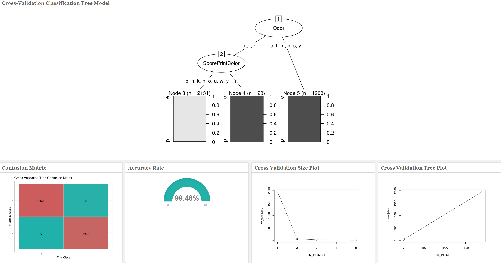
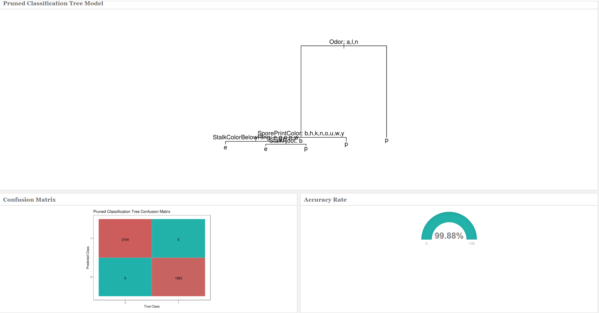
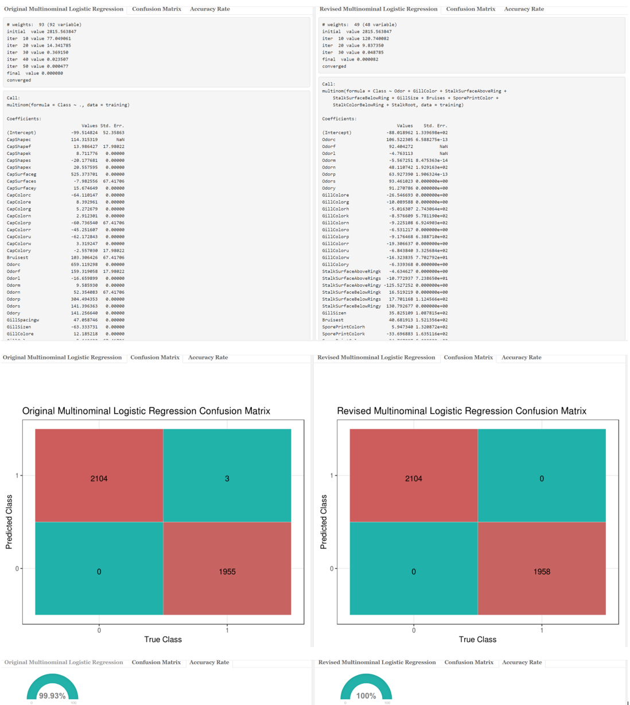

```{r document setup, include=FALSE}
#knitr::opts_chunk$set(echo = TRUE)
knitr::opts_chunk$set(fig.align="center",
                      warning = FALSE,
                      message = FALSE,
                      comment = NA)
```

### Executive Summary  
This report will explore the process of analyzing different mushroom characteristics to develop a system to classify different mushrooms as being edible or poisonous with the aim to reduce the chance of mushroom hunters misclassifying and consuming poisonous mushrooms.  There is no simple rule for determining the edibility of a mushroom.  Despite the risk, mushroom hunting is growing in popularity.  Therefore, data was collected from the Audubon Society Field Guide to North American Mushrooms in attempt to facilitate identifying foraged mushrooms as being edible or poisonous.  Available records cover 23 different gilled mushroom species from the Agaricus and the Lepiota Mushroom Family.  This data on mushroom characteristics for thousands of mushroom observations went through a variety of different analytical techniques.  Multiple models were developed to determine if there is a way mushrooms can be classified as edible or poisonous based on other characteristics.  Models included a Cross-Validation Classification Tree, a Pruned Classification Tree, and two different Multinomial Logistic Regressions were developed.  All models performed well with extremely high accuracy rates in classifying the observations, so selecting the best model comes down to implementation.  The regression models are too complex to allow easy implementation.  For the classification trees, the Cross-Validation Classification Tree used 2 more variables than the Pruned Classification Tree.  This means the Cross-Validation Classification Tree has a greater chance for being able to classify a wider range of mushrooms. Therefore, the Cross-Validation Classification Tree was selected as being the best model with this dataset to best classify mushrooms as being poisonous or edible.  In addition, data was analyzed to uncover if there are certain mushroom characteristics that only indicate a poisonous or edible mushroom.  Specific mushroom characteristics that only edible mushroom observations had include odors of almonds or anise, red or orange gill colors, buff or purple spore print colors, rooted stalks, and stalk colors below the ring of gray, red, or orange.  Characteristics that only applied to the poisonous mushroom observations include buff or green gill colors, green or yellow spore print colors, and stalk colors below the ring of buff, cinnamon, or yellow.  Odors pertaining only to poisonous mushrooms include creosote, could, musty, pungent, spicy, and fishy. 

**Business Questions**

*	Which analytical model can best classify poisonous and edible mushrooms?
*	Are certain mushroom characteristics only indicative of a mushroom being poisonous?
*	Are certain mushroom characteristics only indicative of a mushroom being edible? 

### Data Understanding & Preparation
**Data Source**

The dataset was found through Kaggle, formatted as a CSV file with 8,124 records and 23 fields.  The dataset originated from the UCI Machine Learning repository's mushroom dataset developed in 1987.  (https://www.kaggle.com/uciml/mushroom-classification/version/1#_=_).  The mushroom records correspond to 23 gilled mushrooms species in the Agaricus and Lepiota Mushroom Family from the Audubon Society Field Guide to North American Mushrooms.

**Variable Dictionary**

**Data Preparation**

Before analysis can be started, the data went through a data preparation stage.  Data cleaning began by creating friendly names for the variables.  Running some basic statistics revealed that all variables are categorical.  It was also revealed that the Veil Type, Veil Color, and Gill Attachment variables only had a single categorical level represented in the dataset.  This inhibits the usefulness of these variables in classification models.  Therefore, all three of these variables were excluded from the dataset, as well as any records with missing values.  Finally the data was partitioned allowing 50% of the data for training any models and 50% of the data for testing any models.   

### Anlaysis
**Exploratory Analysis**

In total the dataset contains 8,124 observations for 23 different variables.  All variables are categorical.  Even the target variable is a binary variable classifying each mushroom record as being poisonous or edible.  Overall, 51.80% of the observations belong to edible mushrooms and 48.20% of the observations belong to poisonous.  The Variable Cross Tabulation Matrix below clearly displays the category distributions for each variable.  The distribution of the target variable among the independent variables is also visible by color.  Class “e” in red is for edible mushrooms and class “p” in blue is for poisonous mushrooms.

*Variable Cross-Tabulation Matrix*


**Cross-Validation Classification Tree**

The cross-validation classification tree model was built utilizing all independent variables to classify the target mushroom classifications.  The model was first developed with the training data and then performance was measured by applying and comparing model performance with the testing data.  The resulting classification tree includes 3 nodes.  The model’s important variables in order of highest importance first include: Odor, Gill Color, Stalk Surface Above Ring, Stalk Surface Below Ring, Gill Size, and Bruises.  Visuals of this model are included below.  The resulting accuracy rate of this classification tree is 99.48%. The classification rate for a mushroom to be correctly classified as edible is 99.01% and 100% for correctly classifying a poisonous mushroom.  The cross-validation size plot and the cross validation tree plot were then developed to help determine beneficial ways to prune the classification tree.  These plots are used to help determine the number of nodes and trees to utilize when pruning the tree to compare how the models fit the data.

*Cross-Validation Classification Tree Flexdashboard Display*


**Pruned Classification Tree**

The pruned classification tree has 5 terminal nodes.  Variables in use include Odor, Spore Print Color, Stalk Color Below Ring, and Stalk Root.  A confusion matrix was then designed after the classification tree was ran with the data set aside for testing.  The resulting accuracy rate for the tree is 99.88%.  Both the Pruned Classification Tree and the Cross-Validation Classification Tree performed very well in correctly classifying the dataset’s poisonous and edible mushrooms. By pruning the classification tree the accuracy rate increased from 99.48% to 99.88% and the amount of important variables for the model reduced to 4.  The other tree had 6 important variables.  

*Pruned Classifiction Tree Flexdashboard Display*


**Multinominal Logistic Regression**

Originally a Multinomial Logistic Regression to classify poisonous and edible mushrooms employing all independent variables.  This produced a model that when evaluated with the testing data, had an accuracy rate of 99.93%. However, the model is overly complex with the large quantity of categorical independent variables.  Therefore, another model was built. The Revised Multinomial Logistic Regression only included the independent variables that either of the two Classification Tree Models found to be important variables.  When the testing data was applied to this model, the Revised Multinomial Logistic Regression had an accuracy rate of 1.  There were no false negatives or false positives in the model’s confusion matrix.  

*Multinominal Logistic Regression Flexdashboard Display*


**Analysis of Mushroom Characteristics**
Variables deemed important through the classification modeling were further analyzed.  To test for associations between pairs of variables, Chi Square testing was applied. Based on results, all instances reveal there to be association between the pairs of variables. With variable associations confirmed, the dataset was split into a dataframe containing only the poisonous mushroom observations and a dataframe containing only the edible mushroom observations. Major findings are listed below, followed by screenshots of the flexdashboard as its scrolls down through the different utilized data visualizations. 

*Odor*  
•	Only edible: almonds or anise  
•	Only poisonous: creosote, foul, musty, pungent, spicy, fishy  
•	Odorless mushrooms were more commonly edible  

*Gill Color*  
•	Only edible: red or orange  
•	Only poisonous: buff (most common) or green  
•	Edible counts all < 1000, poisonous counts all < 2000  

*Stalk Surface Above & Below Ring*  
•	Similar distirubuton for both variables  
•	No unique characteristics for being edible or poisonous  
•	Mostly edible: smooth above or below ring (~3,500 instances)  
•	But smooth stalk surface was commonly poisonous too  
•	Lowest representation in general were scaly stalk surfaces  

*Gill Size*  
•	Binary where broad or narrow gills could be edible or not  
•	Edible: vastly more commonly broad (~4000)  
•	Poisonous: more commonly narrow  

*Bruises*  
•	Binary where bruising is not unique to a target  
•	Edible mushrooms more commonly bruised   
•	Most poisonous mushrooms could not bruise (>3000)   

*Spore Print Color*   
•	Lower cateogry counts, below 2000 per level  
•	Only edible: buff or purple, though with low counts   
•	Only poisonous: green or yellow, also with low counts  
•	Most commonly edible: black or brown   
•	Most commonly poisonous: chocolate or white  

*Stalk Color Below Ring*  
•	White stalks were most common in general  
•	Only edible: gray (most common), red, orange  
•	Only poisonous: buff (most common), cinnamon, yellow   

*Stalk Root*  
•	All category counts were low, below 2000  
•	Only edible: rooted stalks  
•	Bulbous stalk roots were most common in general  
•	Missing stalk roots were more commonly poisonous   

*Flexdashboard Display for Mushroom Characteristics*


### Results

**Which analytical model can best classify poisonous and edible mushrooms?**

*The Cross-Validation Classification Tree*  

All classification models performed well, with high accuracy.  However, both Multinomial Logistic Regressions were extremely complex with structure. The classification trees will be easier to implement on new data.  As the accuracy rates for both models is high, choosing the best model comes down to implementation. Of the classification trees, the Cross-Validation Classification Tree used 2 more variables than the Pruned Classification Tree.  This means the Cross-Validation Classification Tree has a greater chance for being able to classify a wider range of mushrooms. Therefore, the Cross-Validation Classification Tree was selected as being the best model with this dataset to best classify mushrooms as being poisonous or edible.  

**Are certain mushroom characteristics only indicative of a mushroom being poisonous?**  

• *Odors:* creosote, foul, musty, pungent, spicy, fishy    
  
• *Gill Colors:*  buff, green    

• *Spore Print Colors:*  green, yellow     

• *Stalk Color Below Ring:*  buff, cinnamon, yellow   

**Are certain mushroom characteristics only indicative of a mushroom being edible?**  

• *Odors:*  almonds, anise    

• *Gill Colors:* red, orange    

• *Spore Print Color:*  buff, purple      

• *Stalk Color Below Ring:*  gray, red, orange    

• *Stalk Root:*  rooted    

### Conclusion  

Data on mushroom characteristics for thousands of mushroom observations went through a variety of different analytical techniques.  Multiple models were developed to determine if there is a way mushrooms can be classified as edible or poisonous based on other characteristics.  Models included a Cross-Validation Classification Tree, a Pruned Classification Tree, and two different Multinomial Logistic Regressions were developed.  All models performed well with extremely high accuracy rates in classifying the observations, so selecting the best model comes down to implementation.  The regression models are too complex to allow easy implementation.  For the classification trees, the Cross-Validation Classification Tree used 2 more variables than the Pruned Classification Tree.  This means the Cross-Validation Classification Tree has a greater chance for being able to classify a wider range of mushrooms. Therefore, the Cross-Validation Classification Tree was selected as being the best model with this dataset to best classify mushrooms as being poisonous or edible.  In addition, data was analyzed to uncover if there are certain mushroom characteristics that only indicate a poisonous or edible mushroom.  Specific mushroom characteristics that only edible mushroom observations had include odors of almonds or anise, red or orange gill colors, buff or purple spore print colors, rooted stalks, and stalk colors below the ring of gray, red, or orange.  Characteristics that only applied to the poisonous mushroom observations include buff or green gill colors, green or yellow spore print colors, and stalk colors below the ring of buff, cinnamon, or yellow.  Odors pertaining only to poisonous mushrooms include creosote, could, musty, pungent, spicy, and fishy. 

### Appendix: R Code

**Complete Flexdashboard R Code**
```{r code=readLines(knitr::purl('Mushroom Flexdashboard.Rmd', documentation = 0)), eval = FALSE}

```
